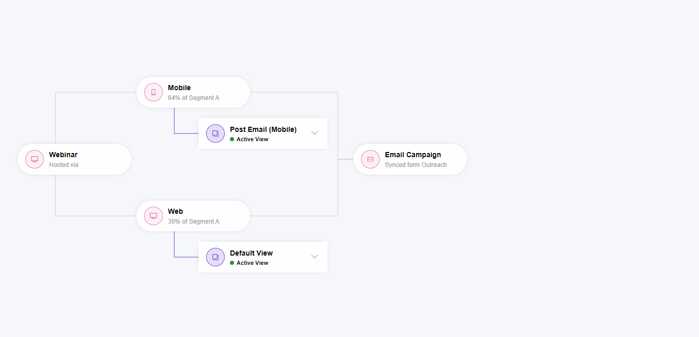

# Journey Map for VHL Sistemas - Elington Silva

Esse projeto foi implementado com Vue.js e Sass como 2ª parte do desafio da VHL Sistemas



## Funcionalidades Desenvolvidas:
- Consulta de dados em arquivos .json
- Adição e Exclusão de itens.
- Remoção de conexão de itens.
- Adição de conexão em itens já existentes.
- Arrastar de itens.

## Project setup
```
npm install
```

### Compiles and hot-reloads for development
```
npm run serve
```